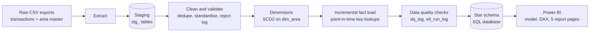
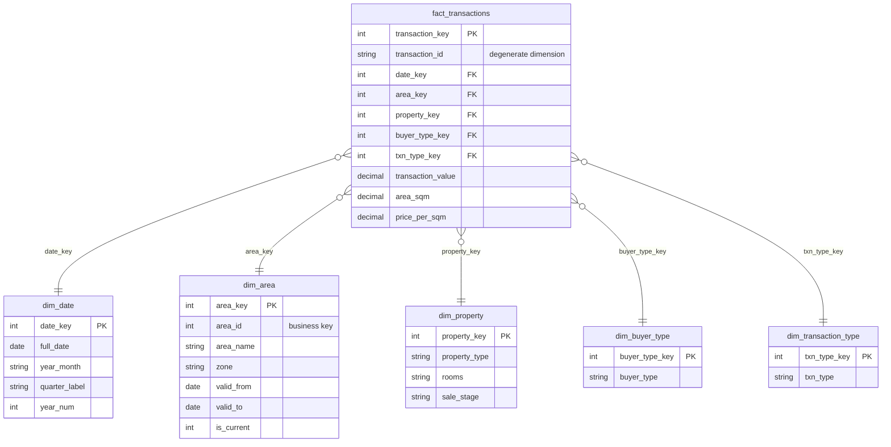

# Dubai Real Estate Data Warehouse (Star Schema, Python ETL, SQL, Power BI)

An end-to-end analytics engineering project: raw property-transaction files go through a Python ETL pipeline into a dimensional **star schema** (with **SCD Type 2** history, **incremental loading** and automated **data quality checks**), and are then modelled and visualised in **Power BI**.

## What this demonstrates

- Dimensional data warehouse design using Kimball methodology
- Python-based ETL with staging, validation and a reject table
- Idempotent batch loads (re-running a load inserts 0 new rows)
- SCD Type 2 historical dimension management with point-in-time joins
- Automated data quality and reconciliation checks (11 per run)
- SQL data modelling and reporting views
- Power BI semantic modelling and DAX measures
- Pipeline monitoring from audit tables (`etl_run_log`, `dq_log`)

## Architecture


## Power BI Report

The report has three pages:

- **Executive Overview:** transaction count, sales value, average price per sqm, year-over-year growth and monthly trend
- **SCD Type 2 History:** areas that moved zones over time, showing sales under the zone that applied at the time of sale
- **Pipeline Health:** ETL run history and data quality results

### Executive Overview


### SCD Type 2: Area Zone History


### Pipeline Health and Data Quality


## Star schema



**Grain:** one row per property transaction.

## Key design decisions

| Decision | Why |
|---|---|
| Surrogate keys on every dimension | Decouples the warehouse from source-system keys and enables history |
| SCD Type 2 on `dim_area` | Areas get re-zoned over time; sales must stay attributed to the zone valid on the sale date |
| Point-in-time lookup when loading facts | Each sale links to the `area_key` version valid on its transaction date |
| Staging layer + reject table | Raw data is kept as received, and every bad row is traceable with a reason |
| Incremental, idempotent load | Re-running a batch loads 0 duplicate rows (anti-join on `transaction_id`) |
| Weighted `Avg Price per sqm` (total value / total sqm) | An average of averages would be wrong across mixed property sizes |
| Dedicated date dimension | Enables time intelligence (YoY, YTD, rolling averages) in DAX |
| Audit tables (`etl_run_log`, `dq_log`) surfaced in Power BI | Pipeline health is visible to business users |

## Data quality checks (run on every load)

Row-count reconciliation, foreign-key integrity on all five dimensions, null checks on measures, business-key uniqueness, SCD2 integrity (exactly one current row per area), plausible price-per-sqm range, and a reject-rate threshold. Results are written to `dq_log` and shown on the Pipeline Health page.

## Run it

```bash
pip install -r requirements.txt
./run_all.sh
```

This generates the raw data, runs the historical load, then runs the incremental load (which triggers SCD2 versioning). Then follow `powerbi/POWERBI_BUILD_GUIDE.md`.

To run steps individually:

```bash
python etl/generate_data.py
python etl/etl_pipeline.py --transactions data/raw/transactions_batch1.csv --area-master data/raw/area_master_v1.csv
python etl/etl_pipeline.py --transactions data/raw/transactions_batch2.csv --area-master data/raw/area_master_v2.csv
```

**Using real data:** download the Dubai Land Department transactions CSV from the Dubai Pulse open-data portal, edit `COLUMN_MAP` in `etl/etl_pipeline.py` to match its headers, and pass it as `--transactions`. The area master can be derived from the same file.

**Different database:** pass `--db "mysql+pymysql://user:pw@host/dubai_dw"` (or a PostgreSQL / SQL Server URL).

## Repository layout

```
etl/generate_data.py      synthetic raw data with realistic defects
etl/etl_pipeline.py       extract, stage, clean, SCD2, incremental load, DQ, export
sql/schema.sql            star schema DDL (tables, keys, indexes, audit tables)
sql/views.sql             reporting views (flat sales, monthly market, area performance)
powerbi/measures.dax      all DAX measures
powerbi/POWERBI_BUILD_GUIDE.md   model, relationships, report pages, RLS
PROJECT_DESCRIPTION.md    CV / LinkedIn / interview write-up
run_all.sh                one-command demo
```

## Tech stack

Python (pandas, SQLAlchemy), SQL (SQLite for local dev; MySQL / PostgreSQL / SQL Server compatible), Power BI (Power Query, DAX, row-level security), dimensional modelling (Kimball), Git.
